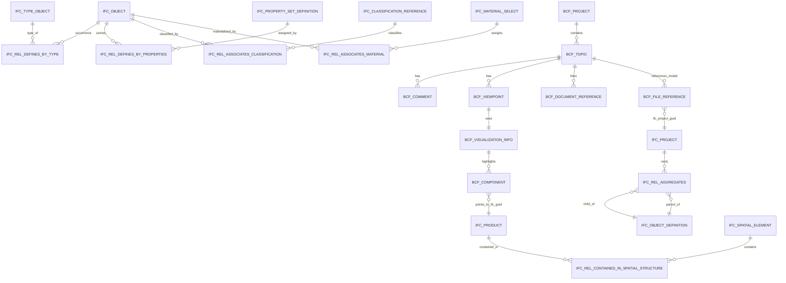
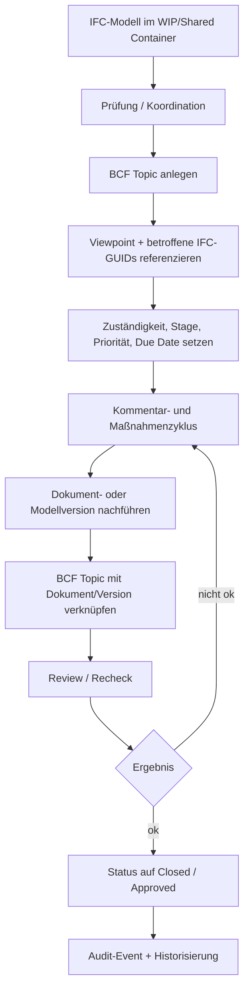

# Neueste BuildingSMART-Standards im DACH-Raum für CDE und BCF

## Executive Summary

Für eine neue CDE im DACH-Raum ist der derzeit robusteste offene Kern **IFC 4.3 ADD2 als kanonisches Datenmodell**, **IFC 4.3 Reference View als Standard-Austauschprofil**, **IDS 1.0 für maschinenlesbare Informationsanforderungen**, **BCF API 3.0 bzw. BCF XML 3.0 sofern die Toolchain es sauber unterstützt**, mit **Fallback auf BCF 2.1** und **Legacy-Lesepfaden für IFC4 ADD2 TC1 und IFC2x3 TC1**. Diese Kombination trifft den aktuellen buildingSMART-Standard-Stack am besten und deckt Modell, Anforderungen, Issues und offene CDE-Integration zusammenhängend ab. citeturn5view0turn6view0turn8view0turn10search0turn12view0turn26search0

Wenn du das Produkt strategisch an einem DACH-Profil ausrichten willst, ist **die Schweiz als Referenzrahmen tatsächlich die beste Ausgangsbasis** — allerdings nicht als exklusiver Sonderweg, sondern als **prozessuales Leitprofil auf einem DACH-neutralen technischen Kern**. Der Grund: Die Schweizer Landschaft kombiniert buildingSMART-/openBIM-Praxis mit **BIM-Abwicklungsmodell**, **LOIN-Anwendungsunterlagen**, **AIM-Grundlagen**, **BIM2FM-Datenfeldkatalog** und **offenen Workflow-Sheets**; das ist für CDE-Produktdesign deutlich nutzbarer als reine Normtitel. Deutschland ist am stärksten bei staatlicher Standardisierung und Governance, Österreich am stärksten bei normativer Verdichtung durch ÖNORM A 6241, aber die Schweiz ist derzeit am ausgewogensten für einen **offenen, lebenszyklusorientierten CDE-Ansatz**. citeturn31view0turn33search3turn33search1turn29search3turn29search16turn34search1turn34search2turn35search1turn35search11turn30search0

Für Rollen, Rechte und Audit sollte die CDE **zweistufig** gebaut werden: **prozessuale Rollen nach ISO 19650/BIM-Informationsmanagement** und **technische Entitätsrechte nach OpenCDE/BCF API**. Konkret heißt das: RBAC als Basismodell, ABAC als Overlay für Status, Phase, Gewerk, Zuständigkeit, Dokumentklasse und Mandant; dazu OAuth2, TLS, ETags, versionierte Dokumente, BCF-Entity-Authorizations, Ereignisprotokollierung und eine saubere Kopplung zwischen Dokumenten und Issues über OpenCDE Documents API bzw. BCF File References. citeturn31view0turn10search0turn11view0turn12view0turn37view3

## Relevante buildingSMART-Standards und aktuelle Versionen

Für **Releasestatus und Veröffentlichungsdaten** habe ich primär die buildingSMART-Standardsdatenbank und offizielle buildingSMART-/GitHub-Quellen verwendet. Bei **BCF/OpenCDE-APIs** weisen die hier zugänglichen offiziellen Seiten den **Finalstatus oder das exakte Veröffentlichungsdatum nicht immer explizit aus**; dort kennzeichne ich konservativ mit „offizieller Releasezweig“ oder „Datum in Quelle nicht explizit ausgewiesen“. citeturn5view0turn13search2turn10search0turn12view0

### Kernstandards für Modell- und Anforderungsdaten

| Standard | Aktuelle relevante Version | Veröffentlichung | Status | Kurzbeschreibung | Quellen |
|---|---|---:|---|---|---|
| IFC | **IFC 4.3 ADD2** | **2024-04** | **Official** | Aktueller offizieller IFC-Kern für Gebäude und Infrastruktur; ISO 16739-1:2024. | citeturn5view0 |
| IFC | IFC 4 ADD2 TC1 | 2017-10 | Official | Älterer, weiterhin offiziell gelisteter IFC4-Stand; in vielen Bestands-Toolchains relevant. | citeturn5view0 |
| IFC | IFC 2x3 TC1 | 2007-07 | Official | Legacy-Standard; in Altbeständen und FM/Bestand weiterhin häufig anzutreffen. | citeturn5view0 |
| IFC | IFC 4.4.x dev | n. a. | Dev / planning | Mögliche Erweiterung von 4.3; laut buildingSMART in Planungsphase. | citeturn5view0 |
| IFC | IFC 5 dev | n. a. | Dev | Nächste Generation, derzeit in Entwicklung. | citeturn5view0 |
| IDS | **IDS 1.0** | **2024-06-01** freigegeben; Kommunikation 2024-06-04 | **Final standard** | Maschinenlesbare Informationsanforderungen für IFC-Validierung; von buildingSMART als finaler Standard bestätigt. | citeturn8view0turn8view1 |
| IDM | ISO 29481-1:2010 Methodik | 2010 | ISO-Standard / Methodik | Beschreibt Prozesse, Austauschzeitpunkte und Informationsflüsse; operative Publikation neuer IDMs erfolgt heute über UCM, historische IDMs liegen im Heritage-Register. | citeturn7view0turn7view1 |
| bSDD | laufender buildingSMART-Dienst | in Quelle nicht explizit ausgewiesen | laufender Service | Zentrales Datenwörterbuch für Klassen, Eigenschaften, Materialien, URIs und Mehrsprachigkeit; in IFC und IDS referenzierbar. | citeturn28view0turn28view1turn28view2 |

### MVDs und Austauschprofile

| MVD / Profil | IFC-Basis | Status | Kurzbeschreibung | Quellen |
|---|---|---|---|---|
| **IFC 4.3 Reference View** | IFC4.3 ADD2 | **Final** | Standardprofil für referenzbasierten, weitgehend gerichteten Austausch; für CDE-Default in Hochbau und viele Infrastrukturfälle am sinnvollsten. | citeturn6view0turn22view1 |
| IFC 4.3 Alignment-based View | IFC4.3 ADD2 | Awaiting final approval | Für Alignments, lineare Platzierung und Infrastruktur; relevant bei Straße/Trasse/Schiene. | citeturn6view0turn22view1 |
| IFC4 Design Transfer View 1.1 | IFC4 ADD2 TC1 | Draft | Höhere Modelltreue für Einweg-Transfer zwischen Authoring-Tools; nicht gleichermaßen breit implementiert. | citeturn6view0turn22view1 |
| IFC4Precast | IFC4 ADD2 TC1 | Final | Spezialisierter Precast-Austausch; laut buildingSMART nicht kompatibel mit Reference View und deshalb als separates Spezialprofil zu behandeln. | citeturn6view0turn27view0 |
| IFC4 Quantity Takeoff View | IFC4 ADD2 TC1 | Draft | Kosten-/Mengenkontext. | citeturn6view0 |
| IFC4 Energy Analysis View | IFC4 ADD2 TC1 | Draft | Energie- und Simulationskontext. | citeturn6view0 |
| IFC4 Product Library View | IFC4 ADD2 TC1 | Draft | Hersteller-/Produktbibliothekskontext. | citeturn6view0 |
| IFC2x3 Coordination View | IFC2x3 TC1 | Final | Altprofil für Koordination; für Bestandsinteroperabilität weiter relevant. | citeturn6view0 |
| IFC2x3 Basic FM Handover View | IFC2x3 TC1 | Final | Übergabe Richtung CAFM/CMMS; weiterhin wichtig für Alt-FM-Prozesse. | citeturn6view0 |

### BCF und OpenCDE APIs

| Standard / API | Relevante Version | Veröffentlichung | Status | Kurzbeschreibung | Quellen |
|---|---|---:|---|---|---|
| BCF XML | 2.0 | **2014-10-01** | Release | Erstes breiteres dateibasiertes Schema-Set mit Project/Markup/Version/Extensions. | citeturn13search2turn19view0turn19view2 |
| BCF XML | 2.1 | **2016-08-01** | **Draft** in offizieller Changelog-Quelle | Erweiterungen u. a. zu DueDate, RelatedTopics, Viewpoint-Index, Visibility-Komponenten. In der Praxis weiterhin sehr verbreitet. | citeturn13search2turn16search4 |
| BCF XML | 3.0 | Datum in den hier genutzten offiziellen Quellen nicht explizit ausgewiesen | offizieller Releasezweig | Aktueller Repo-Zweig; Grundlage vieler moderner BCF-Implementierungen. | citeturn12view0turn14view0turn17view0 |
| BCF API | 2.1 | Datum nicht explizit ausgewiesen | offizieller Spezifikationszweig | REST-Schnittstelle für Topics, Comments, Viewpoints etc. | citeturn10search0turn12view0 |
| BCF API | **3.0** | Datum nicht explizit ausgewiesen | offizieller Spezifikationszweig | Aktueller API-Zweig; basiert auf 2.1 und erweitert OpenCDE-Integration. | citeturn10search0turn12view0 |
| OpenCDE Foundation API | **1.1** | Datum nicht explizit ausgewiesen | offizieller Releasezweig | Discovery, Authentifizierung, Versionsdienst, gemeinsame Konventionen für OpenCDE-APIs. | citeturn10search0 |
| OpenCDE Documents API | **1.0** | Datum nicht explizit ausgewiesen | offizieller Releasezweig | Upload/Download/Selektion/Sync von Dokumenten im CDE; verknüpfbar mit BCF. | citeturn11view0turn10search0 |

## IFC- und BCF-Datenstruktur

### IFC-Schema und Serialisierung

IFC ist kein einzelnes Dateiformat, sondern ein **Gesamtstandard aus Schema, Dokumentation, Property-/Quantity-Set-Definitionen und Serialisierungsmechanismen**. buildingSMART veröffentlicht IFC als EXPRESS-Schema, XSD/XML, ergänzend RDF/OWL sowie in Teilen JSON-/Taxonomieformen; als Austauschformate nennt der Standard klartextbasiertes STEP/SPF, XML, RDF/OWL und JSON. buildingSMART empfiehlt für maximale Interoperabilität und geringe Dateigröße weiterhin **STEP Physical File `.ifc`**, während `.ifcXML` lesbarer, aber größer ist und `.ifcZIP` die kleinste paketierte Variante darstellt. citeturn22view0turn22view2turn22view1turn26search0

Architektonisch ist IFC in **vier konzeptuelle Schichten** organisiert: **Resource Layer**, **Core Layer**, **Interoperability Layer** und **Domain Layer**. Für eine CDE ist das wichtig, weil du dadurch zwischen generischen Strukturen, gemeinsamen Austauschkonzepten und domänenspezifischen Entitäten sauber trennen kannst. Auf Core-Ebene haben alle relevanten Objekte oberhalb des Kerns eine globale ID und optional Owner-/History-Informationen. citeturn22view1turn23search0

Die zentrale Objektlogik beginnt bei **IfcProject** als Wurzel und Kontextcontainer. **IfcRoot** liefert die Basisattribute **GlobalId**, **OwnerHistory**, **Name** und **Description**. Darauf folgen die Objekt- und Beziehungshierarchien: **IfcObjectDefinition**, **IfcObject**, **IfcProduct**, **IfcElement**, **IfcSpatialElement**, **IfcTypeObject** und die Objektbeziehungen wie **IfcRelAggregates**, **IfcRelContainedInSpatialStructure**, **IfcRelDefinesByType**, **IfcRelDefinesByProperties**, **IfcRelAssociatesClassification**, **IfcRelAssociatesMaterial**, **IfcRelVoidsElement** und **IfcRelFillsElement**. Für die CDE heißt das: IFC ist semantisch ein **Beziehungsgraph mit stabilen GUIDs**, nicht einfach eine Baumstruktur. citeturn23search8turn23search0turn23search5turn23search1turn24search0turn24search1turn24search2turn23search2turn24search3turn21search6turn23search9

Typische property-basierte Erweiterung läuft über **IfcPropertySetDefinition**, **IfcPropertySet**, **IfcElementQuantity** und ihre Zuweisung über **IfcRelDefinesByProperties**. buildingSMART beschreibt **IfcRelDefinesByProperties** explizit als **N-zu-N-Beziehung**, und **IfcRelDefinesByType** als **1-zu-N-Beziehung** zwischen Typ und Vorkommen. Für Authoring- und CDE-Software ist das entscheidend: Typdaten, Objektdaten, Klassifikation, Material und Mengen dürfen nicht in eine einzige Tabellenform gepresst werden, sondern sollten über getrennte, referenzierbare Domänen geführt werden. citeturn23search2turn23search10turn23search3turn24search2turn23search11turn23search15

Typische Property-/Quantity-Sets sind beispielsweise **Pset_WallCommon**, **Pset_DoorCommon** und **Qto_WallBaseQuantities**. buildingSMART führt dazu ausdrücklich an, dass Property Sets auf Typ- und Objektebene verwendet werden können und häufig überschreibbar sind; Mengenmodelle werden über Quantity Sets wie **Qto_WallBaseQuantities** beschrieben. Typische Felder in `Pset_WallCommon` sind etwa Außen-/Innenbezug, Status oder brandschutzbezogene Eigenschaften; der Standard verweist einzelne Properties wie `IsExternal`, `Status` oder `SurfaceSpreadOfFlame` als referenzierte definierte Eigenschaften. citeturn25search0turn25search1turn25search3turn25search9turn25search15turn25search16turn25search17

### BCF-Schema und BCF-API

BCF ist laut buildingSMART ein **offener Standard für modellbasierte Issues** und existiert in **zwei Nutzungsformen**: **dateibasiert** und **als Webservice**. Das dateibasierte BCF-XML besteht aus mehreren Schemata. `version.xsd` definiert die Version, `project.xsd` das Projekt, `markup.xsd` die Topics/Kommentare/Referenzen, `visinfo.xsd` die kamerabasierte Visualisierung und `extensions.xsd` die projektweiten Kataloge für Status, Typen, Prioritäten, Labels, Nutzer und Stages. citeturn29search10turn29search12turn19view0turn20view3turn14view0turn17view0turn20view0turn20view2

Das Kernobjekt in `markup.xsd` ist **Topic**. Es hat die Attribute **Guid**, **ServerAssignedId**, **TopicType** und **TopicStatus** und Elemente wie **Title**, **Priority**, **Labels**, **CreationDate/CreationAuthor**, **ModifiedDate/ModifiedAuthor**, **DueDate**, **AssignedTo**, **Stage**, **Description**, **BimSnippet**, **DocumentReferences**, **RelatedTopics**, **Comments** und **Viewpoints**. Für Dateireferenzen gibt es im Header **Files** mit Beziehungen zu **IfcProject** und optional **IfcSpatialStructureElement**. Kommentare referenzieren optional einen Viewpoint, und Viewpoints tragen mindestens eine GUID sowie optionale Snapshot-/Sortierdaten. citeturn14view0turn15view0

Die Visualisierung liegt in `visinfo.xsd`: **VisualizationInfo** enthält **Components**, genau eine Kameraart (**OrthogonalCamera** oder **PerspectiveCamera**), optionale **Lines**, **ClippingPlanes** und **Bitmaps**. Komponenten wiederum haben **Selection**, **Visibility** und **Coloring**; referenziert wird primär über **IfcGuid**. Genau hier liegt die saubere Kopplung zu IFC: BCF transportiert nicht das Modell selbst, sondern problembezogene Semantik, Sichtfenster und ausgewählte IFC-Objekte. citeturn17view0

Die **BCF API** modelliert dieselben Kernobjekte als REST-Ressourcen: **Projects**, **Topics**, **Files**, **Comments**, **Viewpoints**, **Related Topics**, **Document References**, **Documents** sowie **Topic Events** und **Comment Events**. Für eine CDE ist vor allem wichtig, dass die BCF API **Autorisierungen pro Entität** kennt. Auf Projektebene und in den Project Extensions werden erlaubte **project_actions**, **topic_actions**, **comment_actions** sowie gültige Status-, Typ-, Label-, User- und Stage-Werte veröffentlicht. Clients können damit die erlaubten UI-Aktionen direkt aus dem Servermodell ableiten. citeturn12view0

### Mapping zu MVD, IDM, IDS und bSDD

**IDM** beschreibt den **fachlichen Prozess**: wer, wann, in welchem Austauschschritt welche Informationen liefern muss. **MVD** beschreibt den **technischen IFC-Footprint** eines spezifischen Use-Cases: welche Entities, Beziehungen, Geometrien und Konzepte verwendet werden sollen. buildingSMART weist ausdrücklich darauf hin, dass MVDs nicht bloß Filter sind, sondern die Verwendung von IFC für konkrete Use-Cases normativ formen. **IDS** definiert dagegen die **maschinenlesbaren Informationsanforderungen** an IFC-Modelle, vor allem für alphanumerische Anforderungen; es ist an IFC gebunden, aber nicht auf Geometrie ausgerichtet. **bSDD** liefert die referenzierbaren Begriffe, Klassen und Properties, die in IFC und IDS verlinkt werden können. citeturn7view0turn27view0turn8view0turn28view0

Praktisch heißt das für deine CDE:  
**IDM/AIA/BAP** definieren den Prozess, **IDS** validiert die Lieferinhalte, **IFC+MVD** strukturieren das Modell technisch, **bSDD** stabilisiert Begriffe und Properties, und **BCF** transportiert modellbezogene Issues. Das ist die sauberste Trennung für eine langfristig wartbare openCDE-Architektur. citeturn7view0turn8view0turn22view0turn27view0turn28view0

### Synthese der Datenstruktur als ER-Modell

Die folgende Darstellung ist eine technisch konsolidierte Sicht auf die oben genannten Spezifikationen. Sie ist **kein offizielles buildingSMART-Diagramm**, sondern eine verdichtete Architektursicht aus den offiziellen IFC- und BCF-Schemata. citeturn23search8turn23search0turn24search0turn24search1turn24search2turn23search2turn14view0turn15view0turn17view0turn12view0

## DACH-Vergleich und Empfehlung für die Schweiz

Deutschland hat die **stärkste öffentliche Standardisierungs- und Governance-Schiene**. BIM Deutschland beschreibt offene, systemneutrale Standards als Kern der Bundesstrategie, arbeitet mit **DIN**, **VDI**, **buildingSMART Deutschland**, **ISO**, **CEN** und buildingSMART-Arbeitsgruppen zu **IDS** und **Open APIs**. Für CDE-Produktentwicklung ist das ein starkes Signal in Richtung **GOI-/Auftraggeberkonformität**, **Informationsmanagement nach ISO 19650** und **föderierte Standardisierung**. Der Nachteil ist: Für Produktdesign ist das eher Governance-getrieben als unmittelbar operativ. citeturn31view0turn31view1

Österreich hat aktuell die **dichteste nationale Normierung** im deutschsprachigen Raum. Austrian Standards führt **ÖNORM A 6241-1:2025** als aktuelle Norm für digitale Bauwerksdokumentation Teil 1; die Shopsuche zeigt **ÖNORM A 6241-2** als aktuelle Norm zum Thema BIM / Level 3-iBIM. Parallel gibt es eine starke buildingSMART-Austria-Ausbildungs- und Glossarstruktur rund um **BIMcert**. Das ist sehr gut für nationale Klarheit, aber aus Produktperspektive stärker an österreichischen Normbegrifflichkeiten und Formaten orientiert. citeturn33search3turn33search1turn32search4turn32search6turn32search9

Die Schweiz hat dagegen die **prozessual brauchbarste Gesamtlandschaft** für eine CDE. Wichtig ist: Das ältere **SIA-Merkblatt 2051** wird laut SIA **Ende 2024 zurückgezogen**. Gleichzeitig baut Bauen digital Schweiz / buildingSMART Switzerland die Praxisbasis sichtbar aus: **LOIN-Grundlagen und Anwendungen** mit Bezug auf **SN EN 17412-1**, **AIM-Grundlagen**, **Datenfeldkatalog BIM2FM**, **BIM-Abwicklungsmodell** sowie offene **Workflow-Sheets** über openBIM.ch. Das BIM-Abwicklungsmodell entstand sogar in Zusammenarbeit mit **SIA** und der **Schweizer Begleitkommission CEN/TC BK 442 AG3 TG2/3**. Genau diese Kombination aus Normnähe, Lebenszyklusorientierung, FM-Übergabe und offener Prozesshilfe ist für den Entwurf eines offenen CDE besonders wertvoll. citeturn29search0turn34search1turn34search2turn35search1turn35search11turn30search0turn29search16turn29search3

### Ländervergleich für eine CDE-Ausrichtung

| Kriterium | Deutschland | Österreich | Schweiz |
|---|---|---|---|
| Öffentliche Governance | Sehr stark über BIM Deutschland, DIN/VDI, Bundesstrategie, ISO 19650-Bezug. citeturn31view0 | Stark normgetrieben über ÖNORM A 6241 und Austrian Standards. citeturn33search3turn33search1 | Weniger zentralstaatlich, aber sehr starke branchengestützte Praxis- und Prozessdokumente. citeturn30search0turn35search11 |
| Praxisleitfäden für Informationsmanagement | Vorhanden, aber stärker standardisierungs- und programmbezogen. citeturn31view0 | Stark in Ausbildung/Normtradition, weniger offen zugängliche operative Artefakte. citeturn32search4turn32search6 | Sehr stark: BIM-Abwicklungsmodell, AIM, LOIN, BIM2FM, Workflow-Sheets. citeturn34search1turn34search2turn35search1turn35search11turn29search16 |
| Eignung als Produkt-Referenzprofil für CDE | Gut für Bundes-/öffentliche Auftraggeber-Konformität. citeturn31view0 | Gut für Österreich-Projekte. citeturn33search3turn33search1 | **Am besten** für offenes, lebenszyklusorientiertes, gewerkeübergreifendes CDE-Produktdesign. citeturn34search1turn34search2turn35search1turn35search11 |
| FM-/AIM-/Handover-Nähe | Mittel. citeturn31view0 | Mittel. citeturn32search6 | **Hoch** durch AIM und BIM2FM-Publikationen. citeturn34search2turn35search1 |

### Empfehlung

**Ja: Schweiz als Referenzprofil ist plausibel und aus CDE-Sicht sinnvoll.**  
Meine konkrete Empfehlung wäre jedoch nicht „Schweiz-only“, sondern:

1. **Technischer Kern DACH-neutral:** IFC 4.3 ADD2 + RV, IDS 1.0, BCF API 3.0/BCF XML 3.0, bSDD-URIs, OpenCDE Foundation + Documents API. citeturn5view0turn6view0turn8view0turn10search0turn11view0turn12view0  
2. **Prozessprofil Schweiz-default:** BIM-Abwicklungsmodell, AIM-, LOIN- und BIM2FM-Logik als Default-Workflows und Default-Datenschnitte. citeturn34search1turn34search2turn35search1turn35search11turn30search0  
3. **Länderadapter:** DIN-/BIM-Deutschland-Views für Bundes-/DE-Projekte und A6241-Adapter für AT-Projekte. citeturn31view0turn33search3turn33search1

Der wichtigste Grund für die Schweiz ist also nicht „größere Marktmacht“, sondern **besserer Produktfit**: Die Schweizer Landschaft liefert derzeit den besten öffentlich sichtbaren Mix aus **openBIM-Prozessmodell, Lebenszyklusübergabe und operativen Artefakten**. citeturn35search11turn34search2turn35search1turn29search16

## Rollen- und Rechte-Modell für CDE und BCF

### Zielmodell

buildingSMART selbst liefert für CDEs **keinen vollständigen Enterprise-IAM-Standard**, aber sehr wohl die technischen Bausteine: **OpenCDE Foundation API** für Auth/Discovery/Konventionen, **Documents API** für Dateien und **BCF API** für Issues samt **per-entity authorization**. Für Rollen und Verantwortlichkeiten ist in DACH die **ISO-19650-Logik** der richtige prozessuale Rahmen. Daraus folgt für eine produktive CDE ein **duales Modell**: **prozessuale Rollen** plus **technische Entitätsrechte**. citeturn10search0turn11view0turn12view0turn31view0

### Empfohlene Rollenhierarchie

Die folgenden Rollenbezeichnungen sind **implementierungsorientierte Empfehlungen**, abgeleitet aus ISO-19650-orientiertem Informationsmanagement und den OpenCDE-/BCF-Fähigkeiten. Sie sind bewusst so formuliert, dass sie in D/AT/CH verständlich bleiben und sich auf Projektrollen, Firmenrollen oder Mandantenrollen abbilden lassen. citeturn31view0turn12view0turn10search0

| Rolle | Zweck | Dokumente | IFC-Modelle | BCF Topics | Workflow | Audit / Admin-Anteil | Normativer Anker |
|---|---|---|---|---|---|---|---|
| **CDE-Administrator** | Technischer Tenant-/Projektbetrieb | Vollzugriff auf Konfiguration, nicht auf fachliche Freigaben | Technisch voll | Technisch voll | keine fachliche Freigabeentscheidung | Vollständige Systemlogs | Foundation API, Documents API. citeturn10search0turn11view0 |
| **Informationsmanager / CDE-Governance** | Informationsmanagement, Konventionen, Containerregeln | Lesen/Strukturieren/Freigaberegeln definieren | Lesen/validieren | Projekt-Defaults, Extensions, Statuslisten | Governance von Gates | Vollständiger fachlicher Auditblick | ISO 19650-Bezug über BIM Deutschland; BCF Project Extensions. citeturn31view0turn12view0 |
| **Lead Appointed Party / Gesamtkoordinator** | Gesamtkoordination auf Auftragnehmerseite | Lesen/hochladen in eigenen Containern | Lesen, koordinativ referenzieren | createTopic, update, createComment, createViewpoint | Übergänge bis „zur Prüfung“ | Voller Blick auf Projektteil | BCF authorization model. citeturn12view0 |
| **Task Team Manager / Disziplinleiter** | Führung Gewerkteam | Schreibrechte in Teamcontainer | Schreiben in Teammodell | update, assign, createComment/Viewpoint | Teaminterne Freigaben | Fachlogs für eigenes Gewerk | ISO 19650-Rollenlogik + BCF actions. citeturn31view0turn12view0 |
| **Modellautor / Fachplaner** | Erzeugt Modelle und Dokumente | Hochladen eigener Versionen | Schreiben im WIP | createTopic, createComment, createViewpoint | keine Gate-Freigaben | Eigene Aktivitäten | Documents API + BCF topic/comment/viewpoint services. citeturn11view0turn12view0 |
| **BIM-Koordinator / Reviewer** | Kollisions- und Qualitätskoordination | Lesen | Lesen/prüfen | update, createComment, createViewpoint, Statuswechsel nach Policy | Prüfung / Rückmeldung | Vollständige Prüflogs | BCF entity authorization + events. citeturn12view0 |
| **Approver / Freigabestelle** | Formale Freigabe | Approve/Publish | Approve/Publish | Statuswechsel auf freigegebene Zustände | Gate-Owner | Unveränderliche Freigabelogs | ISO 19650-orientierte Governance. citeturn31view0 |
| **FM-/Asset-Vertreter** | Betriebs-/AIM-/Handover-Sicht | Lesen, Handover-Anforderungen | Lesen, Handover prüfen | comment/update in Übergabethemen | Abnahme/Handover | FM-relevante Auditspur | AIM/BIM2FM. citeturn34search2turn35search1 |
| **Externer Beobachter/Auditor** | Sichtprüfung/Audit | Read-only | Read-only | Comment optional, sonst read-only | keine | Exportierbare Auditansicht | Foundation conventions, BCF read access. citeturn10search0turn12view0 |

### Rechte- und Policy-Modell

Technisch sollte die CDE **RBAC als Basisschicht** und **ABAC als Overlay** umsetzen:

- **RBAC** steuert, **wer** grundsätzlich welche Ressourcentypen bearbeiten darf: Projekte, Ordner, Dokumente, Modelle, Topics, Comments, Viewpoints.  
- **ABAC** entscheidet, **unter welchen Bedingungen** der Zugriff tatsächlich gilt: Phase, Stage, Thema, Status, Gewerk, Zuständigkeit, Mandant, Vertraulichkeitsklasse, Dokumentklasse, Modellcontainer, Auftragnehmerorganisation, Asset-Typ. Die BCF-Spezifikation liefert dafür bereits passende Domänenfelder wie `topic_status`, `topic_type`, `topic_label`, `users`, `stage` und entitätsspezifische `authorization`-Maps. citeturn12view0

Ein praxistaugliches Policy-Muster für BCF ist:

- **Projektweite Defaults** kommen aus **Project Extensions**.  
- **Lokale Ausnahmen** liegen auf Topic-/Comment-/Project-Ebene im `authorization`-Objekt.  
- **Statuswechsel** sind nicht bloß Schreibrechte, sondern **explizite Transition-Rechte**.  
- **Sichtbarkeit** von Topics kann zusätzlich an **Mandant**, **Gewerk**, **Package**, **Stage** oder **Dokumentklassifikation** gebunden werden. citeturn12view0

Ein sinnvolles Minimalkontingent an BCF-Rechten ist direkt aus der Spezifikation ableitbar:  
`project_actions`: `update`, `createTopic`, `createDocument`;  
`topic_actions`: `update`, `updateBimSnippet`, `updateRelatedTopics`, `updateDocumentReferences`, `updateFiles`, `createComment`, `createViewpoint`;  
`comment_actions`: `update`. citeturn12view0

### Ownership und Audit Logging

Für Ownership sollte die CDE zwischen **Container-Eigentum**, **fachlichem Eigentum** und **Freigabestatus** unterscheiden. Ein hochgeladenes Dokument gehört zunächst dem hochladenden Team-Container; nach einer Freigabe wechselt nicht unbedingt der technische Eigentümer, wohl aber der **publizierte Informationsstatus**. BCF-Topics behalten ihre **GUID** und können zusätzlich ein **ServerAssignedId** tragen, das für menschliche Kommunikation stabil und projektweit eindeutig ist. citeturn12view0

Audit Logging darf nicht nur „wer hat was editiert“ bedeuten. In einer ernsthaften CDE sollten mindestens folgende Ereignisse unveränderlich protokolliert werden: **Login/Auth**, **Rechteresolution**, **Dokument-Upload**, **Versionserzeugung**, **Metadatenänderung**, **Statuswechsel**, **Issue-Erzeugung**, **Kommentar**, **Viewpoint-Änderung**, **Linking von Dokumenten/Topics**, **Freigaben**, **Exporte/Downloads** und **Fehlversuche**. buildingSMART liefert dafür bereits wichtige technische Haken: **ETags** und Conditional Requests in der Foundation API, **Topic Events** und **Comment Events** in der BCF API sowie Owner-/History-Konzepte in IFC. citeturn10search0turn12view0turn23search19

### Empfohlener BCF-Workflow

Die folgende Ablaufdarstellung ist ein umsetzbares Sollmodell, das BCF-Entity-Authorizations, Stage-/Status-Übergänge und Dokumentreferenzen zusammenführt. Sie ist eine technische Synthese aus BCF API, Documents API und den in der Schweiz verbreiteten kollaborativen Informationsmanagement-Ansätzen. citeturn12view0turn11view0turn35search11

## Umsetzungsempfehlungen für Architektur, Integrationen und Compliance

### Zielarchitektur für eine openCDE

Die CDE sollte nicht als monolithischer „Dateiserver mit Kommentaren“ gebaut werden, sondern als **kanonische Informationsplattform mit getrennten, aber eng gekoppelten Domänen**:

1. **Identity & Policy Service** für Nutzer, Rollen, Mandanten, OAuth2, ABAC-Entscheidungen.  
2. **Document Service** für Ordner, Dokumente, Versionen, Binärdateien und Metadaten.  
3. **IFC Model Registry** für Modellcontainer, Versionen, GUID-Indizes, MVD-/IDS-/Validierungsstatus.  
4. **BCF Service** für Projects, Topics, Comments, Viewpoints, Attachments, Events.  
5. **Classification & Dictionary Service** für bSDD, Klassifikationen, Property-Namespaces.  
6. **Validation Service** für IFC-Schema/MVD/IDS-Prüfung.  
7. **Audit/Event Store** für immutable fachliche und technische Ereignisse. citeturn10search0turn11view0turn12view0turn28view2turn9search14

Das empfohlene Default-Profil für den Produktkern ist:

| Bereich | Empfehlung | Begründung | Quellen |
|---|---|---|---|
| Kanonisches Modellformat | **IFC 4.3 ADD2** | Aktueller offizieller Standard für Gebäude und Infrastruktur. | citeturn5view0 |
| Standard-Austauschprofil | **IFC 4.3 Reference View** | Final, breit anschlussfähig, für CDE-Default am stabilsten. | citeturn6view0turn22view1 |
| Informationsanforderungen | **IDS 1.0** | Maschinenlesbare Requirements und Validierung. | citeturn8view0turn8view1 |
| Issue-Austausch | **BCF API 3.0** bevorzugt, Fallback BCF 2.1/3.0 file-based | Moderne offene Issue-Kommunikation. | citeturn12view0turn13search2 |
| Dokumentaustausch | **OpenCDE Foundation 1.1 + Documents API 1.0** | Offener Upload/Download/Discovery-Stack. | citeturn10search0turn11view0 |
| Klassifikation / Properties | **bSDD-URIs** | Konsistente Klassen/Properties für IFC und IDS. | citeturn28view0turn28view2 |
| Legacy-Support | Read/Convert für IFC4 ADD2 TC1 und IFC2x3 TC1 | DACH-Bestand und Toollandschaft. | citeturn5view0 |

### Integrationspunkte zu gängigen Tools

**Revit**: Autodesk dokumentiert den integrierten, zugleich offen gepflegten IFC-Exporter für Revit; damit ist Revit eindeutig ein relevanter IFC-Endpunkt für deine CDE. Für Autodesk-Dokumente und Versionen ist die **Data Management API** der naheliegende Zugang; für Issues stellt Autodesk eine eigene **Issues API** bereit. Das spricht dafür, Autodesk-Seiten über einen **Adapter auf deine kanonische BCF-/Documents-Domäne** zu koppeln, anstatt Autodesk-Issues zum Primärmodell deiner CDE zu machen. citeturn36search13turn37view1turn36search0turn36search24

**Archicad**: Graphisoft unterstützt BCF-Dateiformate im Produkt und bietet in der Developer-API explizite **Issue-Management- und BCF-Import/Export-Funktionen** an. Archicad ist damit ein sehr guter Kandidat für eine tiefe offene BCF-/Issue-Integration. citeturn36search10turn36search2turn37view2

**Solibri**: Solibri positioniert sich klar entlang des **BCF API**-Standards. Der **BCF Live Connector** arbeitet mit cloudbasierten Issue-Management-Systemen, die BCF API-konform sind, und Solibri betont dabei ausdrücklich die vollständige Audit-Trail-Idee. Für QS-/Koordinationsworkflows ist das ideal. citeturn37view3

**BIM 360 / ACC**: Autodesk stellt für Dokumente und Projektstruktur die **Data Management API** bereit; Issues laufen über eigene Issues-Endpunkte. Für eine offene CDE sollte BIM 360/ACC deshalb eher als **externes System mit Adapter** behandelt werden, nicht als semantischer Maßstab für dein internes Issue-Modell. citeturn37view1turn36search0turn36search12

### Sicherheits- und Compliance-Hinweise

Die OpenCDE Foundation API schreibt bzw. empfiehlt mehrere sicherheitsrelevante Grundlagen bereits vor: **OAuth2-basierte Authentifizierung**, **HTTPS/TLS mindestens 1.2**, standardisierte Fehlerobjekte, **ETags**, Datum/Zeit in **RFC3339**, sowie Versions-/Service-Discovery über den Foundation-Versionsdienst. Besonders wichtig: Der **Client Credentials Grant** wird dort explizit **nicht** unterstützt, weil dabei keine User-Identität transportiert wird. Für eine CDE ist das ein starkes Signal zugunsten echter nutzerbezogener Nachvollziehbarkeit. citeturn10search0

Datenschutzrechtlich musst du im DACH-Raum mindestens zwei Ebenen sauber adressieren:

- **Schweiz**: Das revidierte **Bundesgesetz über den Datenschutz** bzw. das neue Datenschutzrecht gilt seit **1. September 2023**; Zweck ist der Schutz der Persönlichkeit und Grundrechte natürlicher Personen bei der Bearbeitung personenbezogener Daten. citeturn38search0turn38search3turn38search6turn38search12  
- **EU/DSGVO**: Für EU-Projekte, EU-Nutzer oder EU-Datenbezug ist die **Verordnung (EU) 2016/679** maßgeblich. citeturn38search15

Für eine BIM-CDE betrifft das insbesondere: **Benutzernamen**, **Freitextkommentare**, **Issue-Historien**, **Snapshots**, **Dateianhänge**, **Freigabeprotokolle** und ggf. personenbezogene Metadaten in Modellen oder Dokumenten. Technisch solltest du deshalb standardmäßig umsetzen:

- Datenminimierung in Kommentaren und Formularen  
- Standardisierte Aufbewahrungs- und Löschregeln je Container/Projekt  
- Trennung von fachlicher Dokumentation und IAM-/Security-Logs  
- Verschlüsselung in Transit und at Rest  
- Mandanten- und Projektisolierung  
- Exportierbare Audit-Trails  
- Standort- und Transfer-Policies für CH/EU-Projekte  
- Rollenbasierte Sichtbarkeit sensibler Attachments und Snapshots. citeturn10search0turn11view0turn12view0turn38search0turn38search15

## Offene Fragen und Grenzen

Einige **BCF-/OpenCDE-Releases** sind in den hier ausgewerteten offiziellen Quellen als **verfügbare Spezifikationszweige** dokumentiert, aber **ohne explizites Veröffentlichungsdatum oder explizite Final-Kennzeichnung**. Das betrifft vor allem Teile von **BCF API 2.1/3.0**, **BCF XML 3.0**, **Foundation API 1.1** und **Documents API 1.0**. Entsprechend habe ich diese konservativ als offizielle Releasezweige statt als „Finalstandard“ bezeichnet. citeturn10search0turn12view0turn14view0

Für **ÖNORM A 6241-2** konnte ich den aktuellen Status und die Shop-/Suchreferenz verifizieren, aber nicht den vollständigen offenen Normtext auswerten; die frei zugänglichen Quellen zeigen also zuverlässig die Existenz und Aktualität, nicht jedoch jedes Detail der operativen Regelung. citeturn33search1turn32search6

Zu **Schweizer Referenzprojekten** habe ich in den hier priorisierten offiziellen Quellen keine konsolidierte, belastbare Projekttabelle gefunden. Meine Empfehlung pro Schweiz basiert deshalb nicht auf einer Zählung von Showcase-Projekten, sondern auf der **Qualität, Aktualität und Anschlussfähigkeit der öffentlich zugänglichen Schweizer Prozess- und Informationsartefakte**. citeturn34search1turn34search2turn35search1turn35search11turn29search16