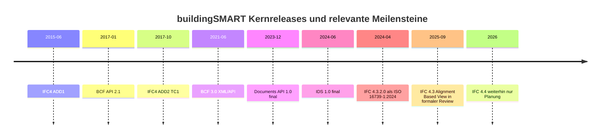
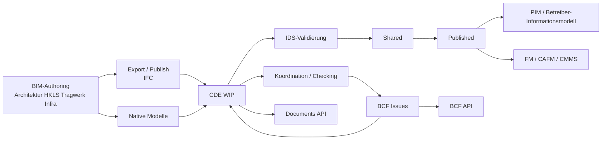
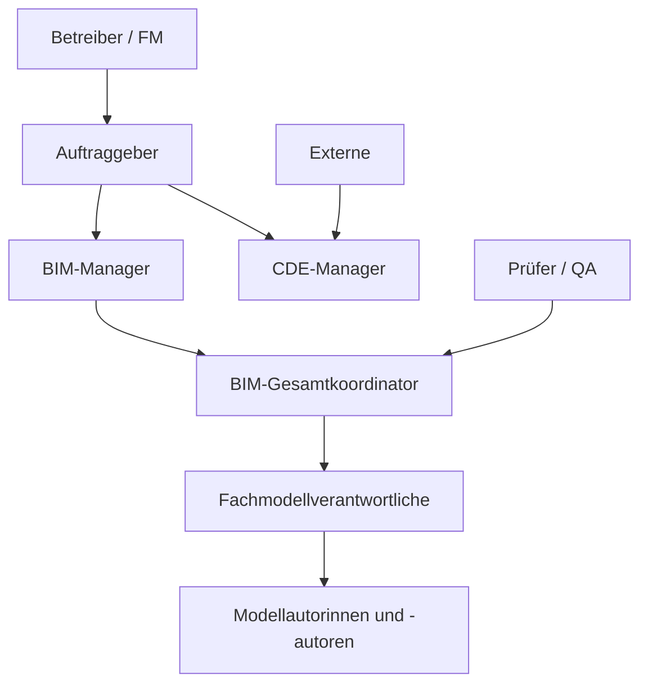

# buildingSMART-Standards im DACH-Raum mit Fokus Schweiz und Kompatibilität zu buildingSMART Italia

## Executive Summary

Der belastbarste Stand zum Mai 2026 ist klar: Für offene, zukunftsfähige BIM- und CDE-Architekturen im DACH-Raum ist **IFC 4.3.2.0** der aktuelle offizielle buildingSMART-/ISO-Standard, während **IFC 4.0.2.1 (IFC4 ADD2 TC1)** weiterhin für viele Hochbau-Workflows relevant bleibt. Bei der Kollaboration ist **BCF 3.0** der aktuelle Zielstandard, in der Praxis muss aber fast immer **BCF 2.1** abwärtskompatibel unterstützt werden. Für prüfbare Informationsanforderungen ist **IDS 1.0** seit Juni 2024 offizieller buildingSMART-Standard. Für CDE-Interoperabilität ist die **openCDE-Familie** mit **Foundation API 1.1** und **Documents API 1.0** der wichtigste Hebel; dazu kommt die **BCF API 3.0** für issue-basierte Zusammenarbeit. citeturn27search5turn15view2turn47search0turn47search4turn15view7turn15view8turn22view0turn21view6

Für die Schweiz ist der Markt besonders attraktiv, weil dort **KBOB**, **SIA**, **Bauen digital Schweiz / buildingSMART Switzerland** und die **schweizerische Einführung der EN ISO 19650** relativ kohärent zusammenspielen. KBOB verlangt in seinen aktuellen BIM-Vertragsbeilagen ausdrücklich Open-BIM-Grundsätze, strukturierte Daten und IFC-bezogene Modellvorgaben; gleichzeitig liefert buildingSMART Switzerland mit nationalem Glossar und aktuellen LOIN-Publikationen eine semantische und methodische Schicht, die für skalierbare CDEs sehr wertvoll ist. Die Schweiz ist damit weniger „regulatorisch hart erzwungen“ als manche Märkte, aber **methodisch sauber, öffentlich anschlussfähig und praxisnah standardisiert**. citeturn15view3turn37search7turn4search8turn37search0turn37search3

Deutschland priorisiert in Bundeskontexten faktisch **Open BIM mit IFC, BCF, CDE nach DIN EN ISO 19650 sowie AIA/BAP-Strukturen**; Österreich stützt sich stark auf die **ÖNORM-A-6241-Familie** und große Infrastrukturauftraggeber wie **ASFINAG** und **ÖBB**. Italien ist auf der Kernschicht **kompatibel**, weil buildingSMART Italia dieselben internationalen Standards trägt; die wesentlichen Unterschiede liegen dort in der **nationalen Überbauung durch UNI 11337**, in der Terminologie (**ACDat/CDE**, *Capitolato informativo*, *Piano di Gestione Informativa*) und in öffentlichen Beschaffungsanforderungen nach **DM 312/2021**. Für grenzüberschreitende CH/IT- oder DACH/IT-Projekte ist also nicht die Standardbasis das Problem, sondern das **Mapping von Rollen, Begriffen, LOIN/LOD-Logik und Vertragsartefakten**. citeturn38search3turn38search7turn19search0turn19search14turn15view5turn7search4turn17search0turn41search2turn41search9turn18search0

Für eine tragfähige CDE empfiehlt sich ein Zielbild mit **IFC als Quellmodell**, **IDS für Lieferanforderungen und Prüfregeln**, **BCF für issue-zentrierte Koordination**, **openCDE Foundation/Documents API für dateibasierte Interoperabilität**, **OAuth2/SSO**, **TLS**, **ETags**, **Audit-Trails**, **klaren WIP/Shared/Published/Archive-Zonen** und einer Rechtearchitektur, die **RBAC als Basis** und **ABAC als Overlay** nutzt. Rein technische Dateiverwaltung ohne semantische Steuerung ist für CH/DE/AT/IT-Projekte zu schwach; entscheidend ist die Verbindung von **Datei**, **Struktur**, **Status**, **Verantwortung** und **prüfbarer Informationsanforderung**. citeturn22view0turn23search0turn21view1turn15view4turn38search3

## Standardlandschaft und aktuelle Releases

Die aktuelle buildingSMART-Landschaft lässt sich in vier Schichten lesen: **Datenmodell** (IFC), **Kollaboration** (BCF), **Anforderungs-/Lieferlogik** (IDS, historisch IDM/MVD) und **plattformübergreifende APIs** (openCDE). Für eine CDE im DACH-Raum mit Schweizfokus ist nicht eine einzelne Spezifikation ausschlaggebend, sondern ihre **komplementäre Kombination**. IFC modelliert das Bauwerk, BCF transportiert Konversations- und Prüfkontext, IDS formalisiert Informationsanforderungen, und openCDE standardisiert die Verbindung zwischen Anwendungen und Datenumgebungen. citeturn21view4turn26view0turn15view7turn21view6

| Spezifikation | Aktueller relevanter Stand | Veröffentlichungsdatum | Status | Kurzbeschreibung | Relevanz für CH/DE/AT/IT |
|---|---|---:|---|---|---|
| IFC | **4.3.2.0** | **2024-04** | offiziell / ISO 16739-1:2024 | Aktuell offizieller IFC-Stand; erweitert IFC auf Gebäude **und** Infrastrukturen. citeturn15view2turn27search5 | Strategischer Zielstand für Infrastruktur und mittelfristig auch für CDE-Kernmodelle in DACH/IT. citeturn27search5turn21view4 |
| IFC | **4.0.2.1 IFC4 ADD2 TC1** | **2017-10** | offiziell / ISO 16739-1:2018 | Stabiler IFC4-Stand für viele Hochbau-Workflows; Korrekturen und Klarstellungen. citeturn15view2turn21view0 | Weiterhin sehr relevant in Hochbau-Toolketten und Bestandslandschaften. citeturn15view2turn42search0turn43search2 |
| IFC | 4.2.0.0 | 2019-04 | zurückgezogen | Zwischenstand auf dem Weg zu Infrastrukturerweiterungen. citeturn15view2 | Nur historisch relevant. |
| IFC | 4.1.0.0 | 2018-06 | zurückgezogen | Basis für Infra-Domains wie Rail/Road/Tunnel/Ports & Waterways. citeturn15view2turn21view0 | Historisch wichtig für Infra-Evolution, heute nicht Zielversion. |
| IFC | **4.4.x dev** | **nicht spezifiziert** | Planungsphase | Offiziell noch **kein** finaler Release; auf der buildingSMART-Datenbank als Planung geführt. citeturn27search6 | Nicht für produktive CDE-Spezifikation als Primärziel verwenden. |
| IFC | **5.0 dev** | **nicht spezifiziert** | in Entwicklung | Nächste Generation, aktuell noch Entwicklung. citeturn27search6 | Beobachten, nicht ausschreiben. |
| BCF XML | **3.0** | **2021-06-18** | final | Aktueller file-basierter BCF-Stand. citeturn21view2turn47search4 | Zielstandard für neue Workflows; 2.1-Fallback meist nötig. |
| BCF API | **3.0** | **2021-06-17** | final | REST-basierte issue-zentrierte Kollaboration; basiert auf 2.1 und nutzt OpenCDE Foundation API. citeturn47search0turn21view1 | Besonders relevant für zentrale CDE-/Issue-Server. |
| BCF API | **2.1** | **2017-01-16** | final | Legacy-/Bestandsstandard, kompatibel mit BCF XML 2.1. citeturn47search0 | De-facto-Fallback in vielen Toolketten. |
| IDS | **1.0** | **2024-06-01** | offizieller buildingSMART-Standard | Prüffähige Spezifikation von Informationsanforderungen; Vorgängerversionen vor 1.0 waren nicht offiziell. citeturn15view7turn12search0turn33view0 | Sehr hohe Relevanz für EIR/AIA, QS und Übergaben. |
| MVD | Reference View 1.2 für IFC4 ADD2 TC1 | **nicht spezifiziert** | offiziell | Definiert den standardisierten IFC-Austausch für Referenzmodelle. citeturn28search2turn28search1 | Praktisch zentral für koordinationsorientierte Workflows. |
| MVD | Alignment Based View 1.0 für IFC4.3 | **nicht final; 2025 in Review** | in Formalisierung | Für IFC4.3 unter offizieller Review/Publikationslogik. citeturn20search1turn28search14 | Relevant für lineare Infrastruktur. |
| MVD | Design Transfer View | **nicht spezifiziert** | nicht sauber finalisiert | buildingSMART beschreibt DTV als nie sauber definiert; geringe Marktnachfrage. citeturn28search12turn20search1 | Nicht als Primärziel für CDE-Ausschreibungen empfehlen. |
| IDM | buildingSMART IDM / EN ISO 29481-Basis | **nicht spezifiziert** | etablierte, ältere Workflow-Basis | Prozess- und Informationslieferbeschreibung; in DE ausdrücklich als ältere BIM-Norm referenziert. citeturn12search14turn38search5 | Für Prozessmodellierung relevant, praktisch heute oft durch IDS/UCM ergänzt. |
| openCDE Foundation API | **1.1** | **nicht spezifiziert** | veröffentlicht | Gemeinsame API-Konventionen für OpenCDE-APIs; REST, JSON, OData, ETags, TLS. Version 1.1 wurde zusammen mit Documents API 1.0 veröffentlicht. citeturn22view0turn22view1 | Grundbaustein für CDE-übergreifende Interoperabilität. |
| openCDE Documents API | **1.0** | **2023-12-21** | final | Standardisiert Auswahl/Download/Upload von Dateien inkl. Metadaten in CDEs. citeturn15view8turn23search0 | Für dateibasierte CDE-Anbindung zentral. |

Die strategische Konsequenz ist pragmatisch: **Hochbau** sollte heute meist auf **IFC4 ADD2 TC1 / IFC4 Reference View** kompatibel bleiben, während **Infrastruktur, Rail, Road, Tunnel, lineare Netze** auf **IFC4.3.2.0** ausgerichtet werden sollten. Für Issues und Review-Kommunikation sollte eine CDE **BCF 3.0** nativ sprechen, aber **2.1 import/export** beherrschen. Informationslieferungen sollten nicht mehr nur textlich im EIR/BAP beschrieben, sondern zusätzlich **als IDS 1.0 maschinenprüfbar** formuliert werden. citeturn21view0turn28search2turn27search5turn47search0turn15view7

## Datenstrukturen und Versionsunterschiede

### IFC als Datenmodell

IFC ist laut buildingSMART ein standardisiertes digitales Beschreibungsmodell des Built Environment. Es codiert **Identität und Semantik**, **Attribute/Eigenschaften** und **Beziehungen** von Objekten, abstrakten Konzepten und Prozessen. Für CDEs ist wichtig, dass IFC nicht nur Geometrie abbildet, sondern die **strukturierte, auswertbare Informationsschicht** bereitstellt, auf der Kollaboration, QS und Übergaben aufbauen. citeturn21view4

Die Kernstruktur eines IFC-Modells besteht typischerweise aus einer **hierarchischen Projekt-/Raumstruktur**, objektbezogenen **Typen**, **Eigenschafts- und Mengenbeziehungen**, **Systemgruppen** sowie **Platzierungs- und Repräsentationslogik**. Dafür sind einige Entitäten und Relationen besonders tragend:

| Bereich | Zentrale Entitäten / Relationen | Funktion im CDE-Kontext |
|---|---|---|
| Identität | `IfcRoot`, `IfcOwnerHistory` | `IfcRoot` liefert u. a. die eindeutige `GlobalId`; `IfcOwnerHistory` beschreibt Erstellungs- und Änderungsverantwortung. citeturn34search7turn34search3 |
| Projekt- und Raumstruktur | `IfcBuilding`, `IfcFacility`, `IfcFacilityPart`, `IfcBuildingStorey`, `IfcSpace`, `IfcRelAggregates` | Hierarchische Zerlegung von Projekt/Bauwerk/Teilbauwerk/Geschoss/Raum bzw. Facility-FacilityPart-Strukturen. `IfcRelAggregates` bildet Whole-Part-Beziehungen. citeturn35search9turn36search2turn36search3turn34search0turn34search13 |
| Primäre räumliche Zuordnung | `IfcRelContainedInSpatialStructure` | Ordnet Elemente einer räumlichen Ebene primär zu; für Viewer, Prüfungen und FM-Auswertungen zentral. citeturn34search1turn34search9turn34search12 |
| Sekundäre räumliche Referenz | `IfcRelReferencedInSpatialStructure` | Zusätzliche Referenzen, z. B. Systeme oder Elemente, die einer Struktur dienen, aber dort nicht primär enthalten sind. citeturn34search5 |
| Typisierung | `IfcRelDefinesByType` | Verknüpft Typen mit Vorkommen; entscheidend für Wiederverwendung und saubere Attributvererbung. citeturn35search2 |
| Eigenschaften | `IfcPropertySet`, `IfcProperty`, `IfcPropertySetTemplate`, `IfcRelDefinesByProperties` | Tragen alphanumerische Informationen; `IfcRelDefinesByProperties` ist N:N und kann mehrere Psets an mehrere Objekte binden. citeturn34search2turn34search20turn34search16turn35search0 |
| Mengen | `IfcElementQuantity` | Standardisierte oder regional vereinbarte Mengen mit MethodOfMeasurement; für AVA, Kosten, FM wesentlich. citeturn35search6 |
| Systeme | `IfcSystem`, `IfcRelAssignsToGroup` | Funktionale Gruppierung von Produkten/Anlagen, etwa HKLS-, Elektro- oder Struktursysteme. citeturn34search4turn35search7 |
| Platzierung | `IfcLocalPlacement`, `IfcLinearPlacement` | Lokal-relative Platzierung im Hochbau bzw. lineare Referenzierung im Infrastrukturkontext. citeturn36search12turn36search1 |
| Infrastruktur-Referenzierung | `IfcAlignment` | Leitobjekt für lineare Werke wie Schiene, Straße, Brücke. citeturn36search0turn36search16 |

Für Dateiformate ist buildingSMART eindeutig: **SPF (`.ifc`)** ist für dateibasierten Austausch am kompatibelsten und am kompaktesten; weitere offizielle Formate sind **`.ifcXML`**, **`.ifcZIP`**, sowie RDF/TTL auf Basis von **ifcOWL**. **JSON** gilt in der offiziellen Formatübersicht aktuell als **provisional/candidate**, nicht als final etabliertes Austauschformat. citeturn29view0

### Unterschiede zwischen IFC4 und IFC4x3

Der wichtigste Unterschied ist **nicht kosmetisch**, sondern strukturell: **IFC4** ist der stabile Hochbau-/Gebäudekern mit verbessertem Property-, Geometrie- und MVD-Fokus; **IFC4x3** erweitert denselben Kern auf **Infrastrukturdomänen** und führt dafür u. a. **Alignment**, **Linear Placement**, **Facility/FacilityPart** und weitere lineare/infrastrukturspezifische Abstraktionen ein. buildingSMART beschreibt IFC4.1 ausdrücklich als Vorstufe für Infra-Domains und IFC4.3 als Erweiterung für Rail, Road, Ports und Waterways. citeturn21view0turn28search3turn36search0turn36search2

| Thema | IFC4 / IFC4 ADD2 TC1 | IFC4x3 / IFC 4.3.2.0 |
|---|---|---|
| Primärer Fokus | Gebäudeorientierte, breit implementierte IFC4-Basis. citeturn21view0turn15view2 | Gebäude **und** lineare Infrastruktur in einem offiziellen ISO-Stand. citeturn27search5turn36search2 |
| Modellviews | IFC4 Reference View und historisch Design-Transfer-Diskussionen. citeturn21view0turn28search2turn28search12 | Policyseitig Reference View, Alignment Based View und Design Transfer View; AbV für lineare Infra relevant. citeturn28search14turn20search1 |
| Platzierung | Vor allem `IfcLocalPlacement`; lineare Referenzierung nicht Kernmechanik. citeturn36search12 | `IfcLinearPlacement`, `IfcAxis2PlacementLinear`, Alignment-Geometrie, ISO-19148-Bezug. citeturn36search1turn36search9turn36search5 |
| Raum-/Facility-Modell | Klassische Building/Storey/Space-Logik dominiert. citeturn35search9 | Generalisierte Facility-/FacilityPart-Abstraktion für Gebäude, Bridge, Railway, Road etc. citeturn36search2turn36search3 |
| Praktische Empfehlung | Für Hochbau-Interoperabilität oft weiterhin Minimalziel. | Für Infrastruktur und künftig gemischte Portfolios strategisches Zielbild. |

Wichtig ist auch die formale Lesart der aktuellen IFC4.3-Dokumentation: Die öffentlich bereitgestellte **IFC 4.3.2.0 Documentation** ist laut buildingSMART **semantisch identisch mit dem ISO-Release**, enthält aber zusätzliche Beispiele, Klarstellungen und Tippfehlerkorrekturen – also **kein anderer Schema-Stand**, sondern eine präzisierte Dokumentationsschicht. citeturn21view3turn36search6

### BCF als Kollaborationsmodell

BCF ist das Gegenstück zu IFC auf der **Kommunikations- und Issue-Ebene**. buildingSMART beschreibt BCF als Standard, mit dem Anwendungen **modellbasierte Issues/Topics** austauschen, indem XML-formatierte Kontextdaten, PNG-Snapshots, IFC-Koordinaten und Referenzen auf Modellobjekte via IFC-GUID übertragen werden. BCF kann entweder **dateibasiert** als **`.bcfzip`** oder **servicebasiert** via REST-API genutzt werden. citeturn26view0turn27search7

Für die Datenstruktur entscheidend sind dabei nicht nur Titel und Kommentare, sondern vor allem **Viewpoints** und **Objektreferenzen**. Ein BCF-Topic besteht fachlich aus einer **Issue-Beschreibung** mit Status/Typ/Labels/Priorität/Zuweisung, einer oder mehreren **Ansichten** mit Kamera-, Sichtbarkeits- und Selektionseinstellungen sowie optional verknüpften **Dateireferenzen**, **BIM-Snippets**, **Kommentaren** und **Related Topics**. In der API werden diese als Projekte, Topics, Comments, Viewpoints, Files und Related Topics modelliert; Wertebereiche wie Status, Topic-Typ oder Priority werden über **Project Extensions** gesteuert. citeturn24view0turn24view1turn24view3turn24view5turn27search7

| Ebene | Typische BCF-Inhalte |
|---|---|
| Projekt | Projektmetadaten und zulässige Werte über Project Extensions. citeturn24view0 |
| Topic / Issue | GUID, Titel, Typ, Status, Priorität, Labels, Zuweisung, Beschreibung, optionale BIM-Snippets. citeturn24view1 |
| Kommentar | Diskussionsverlauf und Bearbeitungsstände. citeturn24view0turn24view1 |
| Viewpoint | Kameraposition, Sichtbarkeiten, selektierte Komponenten, Schnittebenen, Snapshot. citeturn27search7turn26view0 |
| Dateireferenz | Verknüpfung zu betroffenen Modellen/Dateien; in moderner Integration ggf. Verweis auf Documents API. citeturn24view3turn23search0 |
| Berechtigung | Projektweite Defaults plus objektbezogene Overrides via `includeAuthorization`. citeturn24view2turn24view1 |

### Unterschiede zwischen BCF 2.1 und BCF 3.0

BCF 3.0 ist laut buildingSMART/GitHub **auf 2.1 aufgebaut**, aber für moderne CDE-Integrationen deutlich besser anschlussfähig. Die prägnantesten Unterschiede liegen weniger in der Grundidee „Issue + Viewpoint“, sondern in der **API-Reife**, in der **OpenCDE-Integration**, in **Berechtigungsmodellen** und in der besseren Eignung für zentrale Server- und Plattformworkflows. citeturn21view1turn47search0

| Thema | BCF 2.1 | BCF 3.0 |
|---|---|---|
| Aktueller Stellenwert | Weit verbreiteter Bestandsstandard. citeturn47search0 | Aktueller Zielstandard für neue Implementierungen. citeturn47search0turn47search4 |
| API-Generation | Finale API 2.1 seit 2017; kompatibel zu XML 2.1. citeturn47search0 | Finale API 3.0 seit 2021; basiert auf 2.1 und nutzt OpenCDE-Fundamente. citeturn21view1turn47search0 |
| Auth/Berechtigungen | Funktionsfähig, aber weniger formal an OpenCDE gerahmt. | Mit Foundation API, per-entity authorization und Project Extensions deutlich sauberer für CDE-Betrieb. citeturn21view1turn24view0turn24view2 |
| Dokumentintegration | Typisch eher lose gekoppelt. | Kann Dateireferenzen mit Documents API koppeln (`open-cde-documents://…`). citeturn23search0 |
| Empfehlung | Fallback unterstützen. | Primär implementieren. |

### MVD, IDS und IDM im Zusammenspiel

**MVDs** sind laut buildingSMART **Subsets des IFC-Schemas** für konkrete Datenaustausche zwischen Softwarelösungen; formalisiert werden sie mit **mvdXML**. Der **Reference View** ist der Normalfall für koordinationsorientierten Einwegeaustausch. citeturn28search1turn28search4turn28search2

**IDS** adressiert ein anderes Problem: Nicht „welcher Schemasubset wird transportiert?“, sondern **welche Information muss enthalten sein und wie wird das automatisiert geprüft?** Laut buildingSMART kann IDS Anforderungen an **Eigenschaften, Mengen/Attribute, Materialien, Klassifikationen, Entitätstypen und `partOf`-Abhängigkeiten** formulieren; Geometriedetails sind nicht der Hauptzweck. Genau deshalb ist IDS für EIR/AIA, Model Checking und FM-Übergaben heute oft der praktischere Hebel als rein textliche Lastenhefte. citeturn30search1turn15view7turn33view0

**IDM** wiederum bleibt die eher prozessuale Ebene – die Beschreibung von **wer wann welche Information liefern muss**. buildingSMART und nationale Glossare referenzieren IDM weiterhin als valide Grundlage, aber in modernen CDE-Stacks wird es faktisch häufig durch die Kombination **ISO 19650 + IDS + UCM + BAP/BEP** operationalisiert. Der belastbare Punkt ist: **IDM erklärt den Prozess, IDS macht Anforderungen maschinenprüfbar.** citeturn12search14turn38search5turn37search9turn21view6

## Ländervergleich DACH und Italien

### Schweiz

In der Schweiz entsteht der stärkste Mehrwert nicht aus einem isolierten IFC-Mandat, sondern aus der **Kombination aus öffentlichem Auftraggeberrahmen, Normung und nationaler Glossar-/Methodikarbeit**. KBOB stellt aktuelle Vertragsbeilagen zur „Anwendung der Methode BIM“ bereit; deren publizierte Fassungen verweisen auf **Open-BIM-Grundsätze**, strukturierte Datenbereitstellung, **BIM-Modellplan/IFC-Klassen**, sowie auf **BEP/BAP** als zentrales Projektsteuerungsinstrument. Parallel dazu bietet KBOB eine Schweizer Orientierungshilfe zu **SN EN ISO 19650 Teil 1** an. buildingSMART Switzerland wiederum pflegt ein **nationales Glossar** und hat Anfang 2026 aktuelle **LOIN-Grundlagen und Anwendungen** veröffentlicht. citeturn15view3turn37search2turn37search5turn37search7turn4search8turn37search0turn37search3

Der ältere SIA-Anker **SIA 2051** war lange zentral, ist laut SIA aber **per Ende 2024 zurückgezogen** worden. Das ist kein Rückzug aus BIM, sondern eher ein Signal, dass sich die Schweizer Praxis stärker an der **ISO-19650-Familie**, an konkreten Vertragsbeilagen und an aktualisierten methodischen Publikationen ausrichtet. Für die Schweiz spricht daher besonders: **hohe Anschlussfähigkeit an öffentliche Auftraggeber, Lifecycle-Denken, klare Terminologiearbeit und geringe Herstellerbindung im Normdiskurs**. citeturn4search1turn4search4turn37search0

### Deutschland

Deutschland arbeitet stark mit **Rahmendokumenten, Muster-AIA/BAP, BIM4INFRA-Handreichungen und ISO-19650-orientierten CDE-Vorgaben**. BIM Deutschland positioniert Open BIM explizit als gemeinsamen Nenner und beschreibt CDEs normativ im Sinne der **DIN EN ISO 19650**, ergänzt um **VDI 2552 Blatt 5** und weitere Richtlinien. In den öffentlichen Musterunterlagen wird regelmäßig vorausgesetzt, dass Modellchecker und CDEs **IFC und BCF** unterstützen. Der praktische Referenzworkflow ist oft: Fachmodelle via **IFC** in Koordinationswerkzeuge, Änderungsanforderungen via **BCF**, gesteuert über eine CDE. citeturn6search3turn15view4turn38search3turn38search7turn38search4

Deutschland ist damit methodisch stark, aber häufig stärker **prozess- und vorlagenzentriert** als explizit „ein einziges technisches Profil vorschreibend“. Für CDEs bedeutet das: Wer in DE erfolgreich sein will, muss weniger eine nationale Besonderheit im Datenmodell bedienen als vielmehr **AIA/BAP/LOIN/CDE-Disziplin sauber operationalisieren**. citeturn6search7turn38search5turn38search8

### Österreich

Österreich hat mit der **ÖNORM-A-6241-Familie** eine deutlich ausgeprägte nationale BIM-Normungstradition. Offiziell publiziert wurde **ÖNORM A 6241-1:2025** am 15. Oktober 2025 als Nachfolgerin der 2015er Fassung; sie regelt laut Austrian Standards die technische Umsetzung von Datenaustausch und Datenhaltung für Bauwerksinformationen. Daneben bleibt **ÖNORM A 6241-2** als Referenz für **Level 3-iBIM** in Ausbildung und Fachpraxis präsent. buildingSMART Austria positioniert sich ausdrücklich als offene Plattform für digitale Lösungen über den gesamten Lebenszyklus. Gleichzeitig zeigen **ASFINAG** und **ÖBB**, dass BIM in Österreich besonders im Infrastrukturbereich stark institutionalisiert ist; ÖBB verweist seit Jahren auf IFC-Rail-Aktivitäten, ASFINAG auf BIM als Lebenszyklusmethode. citeturn19search0turn19search4turn19search7turn19search15turn15view6turn15view5turn7search4turn7search6

Für Österreich ist daher typisch: **openBIM/IFC ja, aber mit stärkerer nationaler Normüberbauung und hoher Relevanz infrastrukturspezifischer Auftraggeberanforderungen**. Für grenzüberschreitende CDEs sollte man österreichische Projekte deshalb nie nur als „IFC generisch“ behandeln, sondern zusätzlich auf **ÖNORM-Semantik, Datenstrukturen und Auftraggeber-Use-Cases** abbilden. citeturn19search9turn19search12

### Italien und Kompatibilität zu buildingSMART Italia

**Ja, buildingSMART Italia ist grundsätzlich kompatibel** – auf der Kernschicht sogar sehr gut. buildingSMART Italia führt dieselben internationalen openBIM-Standards, nennt ausdrücklich **IFC, BCF, MVD, IDM, IDS** und arbeitet in Infrastrukturdomänen wie **openBIM for Rail** mit Stakeholdern wie **RFI**. Kompatibilität scheitert in IT/DACH-Projekten daher selten an IFC/BCF selbst, sondern an der **nationalen Prozess- und Vertragsschicht**. citeturn18search0turn16search19turn16search17

Die italienischen Besonderheiten sind vor allem diese vier Punkte:

| Thema | Italienische Besonderheit | Auswirkung auf DACH/CH-Kompatibilität |
|---|---|---|
| Öffentliche Beschaffung | **DM 312/2021** modifiziert **DM 560/2017** und regelt die progressive Einführung digitaler Modellierungsmethoden in öffentlichen Verfahren. citeturn17search0 | Vertrags- und Nachweislogik muss italienische Beschaffungsanforderungen abbilden. |
| Nationale Normfamilie | **UNI 11337** ist der zentrale nationale Überbau. Teil 4 behandelt das *Capitolato informativo*, Teil 5 Rollen/Regeln/Flüsse, Teil 7 Rollenprofile. citeturn41search2turn41search9turn41search1 | EIR/AIA, BAP/BEP und Rollen müssen terminologisch und inhaltlich gemappt werden. |
| CDE-Terminologie | Italien nutzt ausdrücklich **ACDat – Ambiente di condivisione dei dati (CDE)**. citeturn41search0turn41search1 | In CH/DE-Projekten sollte ACDat als Synonym zu CDE geführt werden. |
| Rollenmodell | Offizielle Rollenbegriffe wie **BIM Manager**, **BIM Coordinator** und **CDE Manager** sind in der UNI-Logik stark formalisiert. citeturn41search1 | Rollen- und Rechtekonzepte müssen diese Ebenen explizit übersetzen. |

Der sichere Weg für CH/IT- oder DACH/IT-Projekte ist daher: **technischer Kern standardisieren, nationale Überbauten mappen**. Praktisch heißt das: IFC/BCF/IDS/openCDE als gemeinsame Plattformschicht; darüber **zweisprachige IDS**, gemappte Rollenprofile, EIR/AIA ↔ *Capitolato informativo*, BAP/BEP ↔ *Piano di Gestione Informativa* und eine explizite Zuordnung von **LOIN** zu eventuell noch verwendeten **LOD/UNI-11337-Formulierungen**. citeturn15view7turn41search2turn41search9turn41search5

## CDE-Anforderungen und Zielarchitektur

Eine CDE im Sinne von buildingSMART und ISO 19650 ist **mehr als ein DMS**. BIM Deutschland beschreibt sie als zentrale Quelle vertrauenswürdiger Informationen mit versionierten Dateien, Rollen-/Rechtemodellen, Audit-Trail, Freigaben, Dokumenten- und Modellverwaltung sowie offenen Austauschformaten wie IFC, BCF und COBie. Für Open-BIM ist deshalb nicht ausreichend, Dateien „ablegen zu können“; die CDE muss **Standards operationalisieren**. citeturn15view4turn38search1

### Empfohlenes Zielbild für CH-orientierte CDEs

| Architekturbaustein | Empfehlung | Begründung |
|---|---|---|
| Kanonisches Austauschmodell | **IFC4 ADD2 TC1** als Mindestkompatibilität im Hochbau, **IFC4.3.2.0** als Zielstandard für Infrastruktur und strategische Neuprojekte | IFC4 ist breit implementiert; IFC4.3 ist der aktuelle offizielle ISO-Stand und deckt lineare Infrastruktur ab. citeturn15view2turn27search5turn36search0turn36search2 |
| Austauschprofil | **Reference View** als Standardpfad; Alignment/Infra-spezifisch **Alignment Based View**, sobald produktiv benötigt und toolseitig abgesichert | Reference View ist der belastbare Standard; DTV ist nicht sauber finalisiert. citeturn28search2turn20search1turn28search12 |
| Informationsanforderungen | **IDS 1.0** projektbezogen pro Liefergegenstand / Use Case | IDS macht Anforderungen an Entitäten, Properties, Klassifikationen, Materialien und `partOf` prüfbar. citeturn15view7turn30search1 |
| Issue-Kommunikation | **BCF XML 3.0 + BCF API 3.0**, mit **2.1-Fallback** | Neue Server sollten 3.0 nativ bedienen; Bestand interoperiert oft noch über 2.1. citeturn47search0turn47search4turn21view1 |
| Dateiinteroperabilität | **openCDE Foundation API 1.1 + Documents API 1.0** | Standardisiert Upload/Download/Metadaten und CDE-zu-App-Kopplung. citeturn22view0turn23search0turn15view8 |
| Begriffs-/Semantikschicht | **bSDD** plus nationales Glossar/Property-Agreement | bSDD liefert interoperable Begriffsdefinitionen; CH hat ein gepflegtes nationales Glossar. citeturn12search8turn37search0turn37search1 |
| Statuslogik | **WIP / Shared / Published / Archive** nach ISO-19650-Lesart | Standardisiert Freigabe- und Verantwortungszustände in der CDE. citeturn15view4 |
| Übergabe an Betrieb | Published-IFC + strukturierte Dokumente + IDS-Checks + stabile `GlobalId`s | So bleiben Modell, Dokumente und Asset-Fakten FM-fähig. citeturn34search7turn23search0 |

### Integrationspunkte

Die Kernintegrationspunkte einer belastbaren CDE sind typischerweise **BIM-Authoring**, **Koordination/Model Checking**, **PIM/Ownerside Information Management** und **FM/CAFM/CMMS**. Das saubere Muster ist: Authoring-Systeme erzeugen native Modelle und veröffentlichen standardisierte IFC-Lieferungen; Prüf- und Koordinationstools arbeiten gegen IFC und erzeugen BCF-Issues; IDS definiert und prüft die geforderte Informationsqualität; die CDE übernimmt Freigabe, Versionierung, Logging und Dokumentenverknüpfung; Betriebssysteme konsumieren nur **freigegebene, stabile** Datenstände. citeturn38search4turn23search0turn21view1turn15view7

### APIs, Versionierung, Audit und Security

Die **Foundation API** definiert gerade für CDEs einige unterschätzte Kernmechaniken: **REST/JSON**, **Paging/Sorting/Filtering über OData**, **ETags** für Cache- und Änderungssteuerung, **vollständige PUT-Updates**, **CORS** und ausdrücklich **HTTPS/TLS**. Die **Documents API** standardisiert Download-/Upload-Workflows einschließlich Callback-URL, Dokumentmetadaten und auch externer Storage-Ziele. buildingSMART empfiehlt dabei kurze, zufällige, single-use URLs für Selektions- und Upload-Workflows. Die **BCF API** fordert ebenfalls TLS/HTTPS und unterstützt projekt- und objektbezogene Autorisierung. citeturn22view0turn22view1turn23search0turn27search1turn24view2

Für CDE-Ausschreibungen mit Schweizfokus würde ich die Minimalanforderungen deshalb so formulieren:

| Bereich | Mindestanforderung |
|---|---|
| Authentifizierung | SSO-fähig, ideal OIDC/SAML nach außen; API-seitig OAuth2-fähig. citeturn22view0 |
| Transport | TLS-only, keine unsicheren HTTP-Endpunkte. citeturn22view0turn27search1 |
| Versionierung | Immutable Versionen, Hash/ETag pro Ressource, nachvollziehbare Supersession-Logik. citeturn22view0 |
| Audit | Vollständige Protokollierung von Upload, Download, Freigaben, Berechtigungsänderungen, BCF-Statuswechseln. CDE-seitig von BIM Deutschland explizit gefordert. citeturn15view4turn38search7 |
| Aufbewahrung | Archive-State plus rechtssichere Nachvollziehbarkeit. citeturn15view4 |
| Dateisicherheit | Malware-Scanning, MIME-/Extension-Prüfung, kontrollierte Binary Uploads, kurzlebige Upload-URLs. citeturn23search0 |
| Datenhoheit / Datenschutz | In der Schweiz zusätzlich die KBOB-Perspektive zu Datenhoheit, Datensicherheit, Datenschutz und Haftung berücksichtigen. citeturn4search14 |

### EIR/BEP-relevante Vorgaben

Für CH-Projekte muss die CDE nicht nur technisch, sondern auch **vertraglich beschreibbar** sein. KBOB arbeitet mit Vertragsbeilagen zur BIM-Anwendung; BIM Deutschland liefert AIA-/BAP-Muster; Italien arbeitet mit *Capitolato informativo* und *Piano di Gestione Informativa*. Der gemeinsame Nenner ist: Ausschreibungen sollten **Liefergegenstände, Statuslogik, Prüfregeln, Rollen, Austauschformate, Namenskonventionen, Freigabeprozesse und Übergabeanforderungen** nicht offenlassen, sondern explizit definieren – idealerweise teils in **IDS**, teils in **BAP/BEP/AIA/EIR**. citeturn15view3turn38search3turn38search7turn41search2turn41search6

## Rollen, Rechte und Policies

Die offiziellen Quellen aus DACH und Italien sind in der Rollensprache unterschiedlich, aber in der Struktur erstaunlich ähnlich: Es gibt fast immer eine Auftraggeber-/Betreiberseite, eine projektweite BIM-Steuerung, Fachverantwortliche, Koordination/Prüfung sowie eine Plattform-/CDE-Verantwortung. Deutschland spricht in Bundesunterlagen von BIM-spezifischen Rollen und CDE-Nutzerverwaltung; Italien normiert u. a. **BIM Manager**, **BIM Coordinator** und **CDE Manager**; KBOB setzt projektbezogen auf BAP/BEP- und BIM-Verantwortlichkeiten. BCF 3.0 ergänzt dazu ein formales Konzept **projektweiter und objektbezogener Autorisierungen**. citeturn38search2turn41search1turn37search2turn24view2

### Empfohlenes Rollenmodell

| Rolle | Funktion | Norm-/Praxisanker |
|---|---|---|
| Auftraggeber / Bauherr / Informationsbesteller | definiert Informationsziele, AIA/EIR, Freigabelogik, Betriebsanforderungen | KBOB, BIM Deutschland, ISO-19650-Praxis. citeturn15view3turn38search7 |
| CDE-Manager / Projektadmin | technische Plattformhoheit, Nutzer-/Gruppenverwaltung, Metadaten- und Workflowkonfiguration | UNI 11337-7 kennt den CDE Manager explizit; BIM Deutschland fordert Rollen-/Rechteverwaltung. citeturn41search1turn38search3 |
| BIM-Manager / Informationsmanager | methodische Gesamtsteuerung, BAP/BEP, Regelwerk, Qualitätsstrategie | UNI 11337-7 und BIM Deutschland Rollensteckbriefe. citeturn41search1turn38search2 |
| BIM-Gesamtkoordinator | fachübergreifende Modellkoordination, Koordinationsmodell, Clash-/Issue-Steuerung | BIM Deutschland, KBOB-BEP-Logik. citeturn38search7turn37search2 |
| Fachmodellverantwortlicher | Verantwortung für ein Fachmodell und dessen IFC-Lieferung | BIM Deutschland Muster-AIA/BAP. citeturn38search3turn38search7 |
| Modellautor | Erstellung und Pflege nativer Modelle; Veröffentlichung in WIP/Shared | übliche Umsetzungsebene in BIM Deutschland/KBOB-Projekten. citeturn38search2turn37search5 |
| Prüfer / QA / Reviewer | IDS-/Regelprüfung, Freigabeempfehlung, BCF-Rückmeldungen | IDS 1.0 + BCF-Workflows. citeturn15view7turn27search7 |
| Betreiber / FM-Verantwortlicher | definiert Asset-/Übergabeanforderungen, akzeptiert Published-/Archive-Daten | CDE- und Lifecycle-Logik nach BIM Deutschland/KBOB. citeturn15view4turn4search5 |
| Externer Partner / Nachunternehmer | begrenzter Zugriff auf definierte Container, nur rollen- oder attributbasiert | Rollen- und Rechteanforderung aus CDE-Praxis. citeturn38search3 |
| Auditor / Revision / Compliance | lesender Zugriff auf Audit, Freigaben und Historie | Audit-Trail-Anforderung aus CDE-Logik. citeturn15view4turn22view0 |

### Empfohlene Rechtematrix

Die Matrix unten ist **kein Zitat aus einer einzelnen Norm**, sondern ein **empfohlenes Zielbild**, abgeleitet aus ISO-19650-/CDE-Logik, BIM-Deutschland-Vorlagen, KBOB-Praxis und dem per-entity-Autorisierungskonzept der BCF API. citeturn15view4turn38search3turn24view2

Legende: **V** = voll, **E** = eingeschränkt, **L** = lesen, **–** = kein Recht.

| Rolle | WIP lesen/schreiben | Shared freigeben | Published ändern | Archive lesen | IFC Import/Export | BCF erstellen | BCF aktualisieren | BCF schließen | Benutzer verwalten |
|---|---:|---:|---:|---:|---:|---:|---:|---:|---:|
| Auftraggeber | L | V | – | L | E | E | E | V | – |
| CDE-Manager / Projektadmin | V | V | E | V | V | E | E | E | V |
| BIM-Manager | L | V | E | L | E | V | V | V | – |
| BIM-Gesamtkoordinator | L | V | – | L | E | V | V | V | – |
| Fachmodellverantwortlicher | V | E | – | L | V | V | V | E | – |
| Modellautor | V | – | – | L | V | V | E | – | – |
| Prüfer / QA | L | E | – | L | L | V | V | E | – |
| Betreiber / FM | L | E | – | V | E | E | E | E | – |
| Externer Partner | E | – | – | – | E | E | E | – | – |
| Auditor / Revision | L | L | L | V | L | L | L | L | – |

Für BCF ist zusätzlich sauber zwischen **projektweiten Defaults** und **topic-spezifischen Overrides** zu unterscheiden. buildingSMART sieht dafür Project Extensions und objektbezogene `authorization`-Felder vor. Praktisch sollte das so aussehen: Ein Fachmodellverantwortlicher darf Issues seines Fachbereichs aktualisieren, aber **nicht** automatisch fremde Topics schließen; ein Prüfer darf Kommentare und Viewpoints ergänzen, aber nicht Projekt-Extensions ändern; nur Projektadmin/CDE-Manager dürfen Benutzer- und Rollenmodelle verändern. citeturn24view0turn24view1turn24view2

### RBAC oder ABAC

Für reale Projekte ist **RBAC als Basis** fast immer erforderlich, aber **allein nicht ausreichend**. Denn Bauprojekte brauchen regelmäßig kontextabhängige Regeln: Projektphase, Disziplin, Vertragsstatus, Vertraulichkeitsklasse, Lieferstatus und manchmal sogar Standort oder Betreiberrolle. Genau hier ist **ABAC als Overlay** sinnvoll. Die robuste Architektur ist daher **RBAC + ABAC** – nicht entweder/oder. Die technischen Standards erzwingen das nicht vollständig, aber BCF 3.0 liefert mit projektweiten und entitätsspezifischen Autorisierungen bereits die richtige Richtung. citeturn24view2turn24view0

| Policy-Muster | Empfehlung |
|---|---|
| RBAC-Baseline | Rolle bestimmt Grundrechte, z. B. `Modellautor`, `Prüfer`, `CDE-Manager`. |
| ABAC-Overlay | Attribute begrenzen Rechte weiter: `discipline`, `projectPhase`, `containerStatus`, `confidentiality`, `contractLot`, `country`. |
| Beispiel Dokumente | `allow update if role in {Modellautor,Fachmodellverantwortlicher} and document.state == "WIP" and document.discipline == user.discipline` |
| Beispiel Freigabe | `allow publish if role in {BIM-Manager,BIM-Gesamtkoordinator,Auftraggeber}` |
| Beispiel BCF | `allow closeTopic if role in {Prüfer,BIM-Manager,Auftraggeber} and topic.status != "closed"` |
| Beispiel Externe | `allow read if role == Externer and container.visibility == "external-shared"` |
| Beispiel Betreiber | `allow readArchive and exportPublished if role == Betreiber and project.handoverApproved == true` |

## Implementierungspraxis, Interoperabilitätsfallen und Werkzeuge

### Mapping von IFC und BCF in eine CDE

Die fachlich saubere CDE-Implementierung entsteht dann, wenn **Dateiobjekte**, **Modellobjekte** und **Kollaborationsobjekte** getrennt, aber verknüpft verwaltet werden. Ein IFC-Dokument ist dann nicht „das Modell“, sondern **ein versionierter Informationscontainer**, dessen innere Referenzierung auf `IfcProject`/`IfcFacility`, Raumstruktur, `GlobalId`, Properties und Mengen zeigt. Ein BCF-Topic ist correspondingly **kein Dokument im klassischen Sinn**, sondern eine Issue-Ressource mit Referenzen auf Modellobjekte, Ansichten und Dateien. Genau dafür ist die Kopplung zwischen **BCF API** und **Documents API** fachlich stark: Das Issue kann auf ein Dokument- bzw. Modellartefakt verweisen, ohne dessen Binary selbst tragen zu müssen. citeturn23search0turn24view3turn26view0turn34search7

| CDE-Objekt | IFC-/BCF-Anker | Implementationshinweis |
|---|---|---|
| Modellcontainer | IFC-Datei / Document Version | Jede Veröffentlichung erzeugt neue, unveränderliche Version. citeturn23search0 |
| Fachmodellidentität | `IfcProject`, `IfcFacility`, Dokument-Metadaten | Projekt-, Los- und Fachdisziplin-Metadaten außerhalb und innerhalb des IFC konsistent halten. citeturn36search2turn23search0 |
| Bauteil-ID | `IfcRoot.GlobalId` | Nie auf exportabhängige STEP-Zeilennummern stützen; nur `GlobalId` ist dafür gedacht. citeturn34search7turn30search3 |
| Raum-/Anlagenzuordnung | `IfcRelAggregates`, `IfcRelContainedInSpatialStructure`, `IfcRelReferencedInSpatialStructure`, `IfcSystem` | Viewer, Filter, FM-Listen und Prüfregeln hängen von sauberer Struktur ab. citeturn34search0turn34search1turn34search5turn34search4 |
| Alphanumerik | `IfcPropertySet`, `IfcElementQuantity`, `IfcRelDefinesByProperties` | IDS-Prüfungen sollten auf nachweisbare Psets/Quantities gehen, nicht auf Tool-spezifische Parameter. citeturn35search0turn35search6turn15view7 |
| Issue | BCF Topic | Zustände, Labels und Verantwortungen über Project Extensions standardisieren. citeturn24view0turn24view1 |
| Ansicht/Beweisbild | BCF Viewpoint + Snapshot | Für Review und Nachvollziehbarkeit immer mit Snapshot und Modellreferenz speichern. citeturn26view0turn27search7 |
| Regelanforderung | IDS-Datei | IDS versionieren wie Code/Regelwerk; pro Liefergegenstand referenzieren. citeturn15view7turn33view0 |

### Typische Probleme und Best Practices

Die häufigsten Interoperabilitätsprobleme liegen weniger in „falschem IFC“ als in **instabiler Identität, unsauberer Struktur und fehlender Governance**. Wenn `GlobalId`s zwischen Exporten unnötig wechseln, verlieren BCF-Issues und FM-Referenzen ihren Bezug. Wenn Elemente nicht sauber räumlich enthalten sind, werden Filter, Reports und Prüfungen unzuverlässig. Wenn Typ- und Vorkommensattribute gemischt werden, werden QS-Regeln und Auswertungen redundant oder widersprüchlich. Wenn bei Infrastrukturprojekten weiterhin nur lokal platzierte Hochbau-Logik verwendet wird, gehen die Vorteile von IFC4.3 verloren. Diese Probleme sind technisch beherrschbar, aber nur mit klaren Modellierungsregeln und Prüfautomatisierung. citeturn34search7turn34search1turn35search2turn36search0turn36search1

| Problemfeld | Typisches Symptom | Best Practice |
|---|---|---|
| GUID-Churn | BCF-Issues „verlieren“ Bauteile nach Neu-Export | GUID-Stabilitätsregeln im BAP; Nachtests vor Veröffentlichung. citeturn34search7 |
| Falsche Raumzuordnung | Elemente erscheinen im Viewer/Report am falschen Ort | `IfcRelContainedInSpatialStructure` verpflichtend und fachlich definiert prüfen. citeturn34search1turn34search9 |
| Type-vs-Occurrence-Drift | doppelte oder widersprüchliche Properties | Typ- und Vorkommensebene im Modellierungsleitfaden trennen. citeturn35search2turn35search0 |
| Unscharfe Property-Namen | keine belastbaren QS-Regeln, Sprachmix | IDS + Glossar/bSDD + projektweite Pset-Konventionen. citeturn15view7turn12search8turn37search0 |
| Reference-/Full-Verwechslung | Geometrie oder editierbare Intelligenz fehlen unerwartet | Für Austauschziel immer View explizit benennen. citeturn28search2turn28search18 |
| Infra-Georeferenzierung/Linearität fehlt | Trassenelemente sind fachlich nicht auswertbar | Bei Infra IFC4.3 mit Alignment/Linear Placement als Pflichtpfad definieren. citeturn36search0turn36search1turn36search16 |
| BCF ohne File-/Model-Reference | Issue ist dokumentiert, aber operativ schlecht auffindbar | File References / Documents API-Verknüpfung nutzen. citeturn24view3turn23search0 |
| CDE ohne Statusgovernance | ungeklärte „gültige Version“ | WIP/Shared/Published/Archive strikt trennen. citeturn15view4 |

### Werkzeuge mit guter openBIM-Anschlussfähigkeit

Die Tabelle unten ist **nicht** als Marktanteilsranking zu lesen, sondern als **praxisnahe Auswahl** aus der offiziellen buildingSMART-Implementationsübersicht sowie relevanten Infrastrukturlösungen. Wichtig: buildingSMART weist selbst darauf hin, dass diese Supportangaben **vendor-self-reported** und **nicht verifiziert** sind. citeturn42search0turn42search3

| Kategorie | Produkt | Unterstützte Standards laut buildingSMART-Implementationsübersicht | Einordnung |
|---|---|---|---|
| Authoring | **ALLPLAN** | IFC 2x3 / IFC4 / IFC4.3, BCF API 2.0/2.1, IDS 1.0 authoring, bSDD read/export. citeturn43search0 | Für DACH-Projekte interessant, wenn Authoring und openBIM-Authoring in einer Lösung bleiben sollen. |
| Authoring | **Archicad** | IFC 2x3 / IFC4, BCF XML 2.0/2.1/3.0, BCF API 2.0/2.1/3.0, IDS 1.0 authoring. citeturn43search2 | Starke BCF-Anbindung für modellnahe Review-Prozesse. |
| Checking / QS | **Solibri Office** | IFC 2x3 / IFC4 / IFC4.3, BCF XML 2.0/2.1/3.0, BCF API 2.0/2.1/3.0, IDS 1.0 IFC check, Foundation API 1.0, Documents API 1.0. citeturn42search0 | Sehr stark für regelbasierte QS, Issue-Kommunikation und CDE-Kopplung. |
| Coordination / Issue | **BIMcollab Zoom** | IFC 2x3 / IFC4, BCF XML 2.0/2.1, BCF API 2.0/2.1, IDS 1.0 IFC check. citeturn42search1 | Geeignet für issue-zentrierte Koordination; 3.0 ist hier laut Eintrag nicht ausgewiesen. |
| Coordination / VDC | **DESITE BIM** | IFC 2x3 / IFC4 / IFC4.3 inkl. Alignment, BCF XML 2.1/3.0, BCF API 3.0, IDS 1.0 authoring/check. citeturn44search1 | Besonders interessant für DACH-Infrastruktur und bauablaufnahe Koordination. |
| Data Server / Infra | **Quadri** | IFC 2x3 / IFC4 / IFC4.3 full, BCF XML 2.1, BCF API 2.1. citeturn42search2 | Relevant für lineare Infrastruktur- und Datenserver-Use-Cases. |
| CDE / Plattform | **usBIM** | IFC 2x3 / IFC4 / IFC4.3, BCF XML 2.0/2.1/3.0, BCF API 3.0, IDS 1.0 authoring/check, Foundation API 1.0, Documents API 1.0, bSDD. citeturn44search0 | Besonders interessant im italienischen Kontext, aber technisch auch für DACH/CH anschlussfähig. |

Für die Schweiz wäre die nüchterne Empfehlung: **nicht auf einen Monolithen festlegen**, sondern eine Kombination aus **Authoring**, **QS/Koordination**, **standardfähiger CDE** und **regelbasierter Übergabeprüfung** ausschreiben. Entscheidend ist nicht der Markenname, sondern der nachweisbare Support für **IFC**, **BCF**, **IDS** und – wenn CDE-Kopplung ernst gemeint ist – **Foundation/Documents API**. citeturn42search0turn44search0turn21view6

## Quellen und Grenzen

### Priorisierte Referenzen

| Priorität | Quelle | Wofür besonders wichtig |
|---|---|---|
| Primär | buildingSMART IFC Specifications Database und IFC-Standardseiten citeturn15view2turn27search5turn21view4 | Offizielle Releases, Status, Formate, ISO-Referenz |
| Primär | buildingSMART IFC Release Notes und IFC4.3-Dokumentation citeturn21view0turn21view3turn36search0turn36search2 | Unterschiede IFC4 ↔ IFC4x3, Infra-Erweiterungen |
| Primär | buildingSMART BCF Technical Intro, BCF XML/API Repositories und Releases citeturn26view0turn21view1turn47search0turn47search4 | BCF-Struktur, Versionsstände, API-Logik |
| Primär | buildingSMART IDS Standardseite und GitHub Release citeturn15view7turn12search0turn33view0 | IDS 1.0, Status und Funktionsumfang |
| Primär | buildingSMART openCDE / Foundation / Documents API citeturn21view6turn22view0turn23search0turn15view8 | CDE-Interoperabilität, Security, Upload/Download-Workflows |
| Hoch | KBOB Digitalisierung und BIM, KBOB-Vertragsbeilagen, KBOB ISO-19650-Guidance citeturn15view3turn37search2turn37search5turn4search8 | Schweiz, öffentliche Auftraggeberpraxis |
| Hoch | SIA 2051 / SIA-Hinweise citeturn4search1turn4search4 | Schweizer Normhistorie und Übergang |
| Hoch | Bauen digital Schweiz / buildingSMART Switzerland Publikationen, Glossar, LOIN citeturn37search0turn37search1turn37search3 | Schweizer Terminologie und Methoden |
| Hoch | BIM Deutschland CDE-, AIA-, BAP- und BIM4INFRA-Dokumente citeturn15view4turn38search3turn38search4turn38search7 | Deutsche öffentliche Praxis und CDE-Anforderungen |
| Hoch | Austrian Standards zu ÖNORM A 6241 und buildingSMART Austria citeturn19search0turn19search4turn19search7turn15view6 | Österreichische Normüberbauung |
| Hoch | ASFINAG- und ÖBB-Quellen zu BIM/IFC-Rail-Kontext citeturn15view5turn11search1turn7search4turn7search6 | Österreichische Infrastrukturpraxis |
| Hoch | MIT DM 312/2021, UNI 11337, buildingSMART Italia / openBIM for Rail citeturn17search0turn41search2turn41search9turn41search1turn18search0 | Italienische Besonderheiten und Kompatibilität |

### Offene Fragen und Grenzen

Einige Detailpunkte bleiben bewusst als **unscharf oder „nicht spezifiziert“** markiert, weil die öffentlich abrufbaren offiziellen Quellen hierfür keine belastbare Datumsangabe liefern – insbesondere bei einzelnen älteren BCF-XML-Releases, bei der exakten öffentlichen Datierung der **Foundation API 1.1** und bei Teilen der IDM-/MVD-Historie. Wo buildingSMART oder nationale Norm-Stores nur Abstracts oder Datenbankeinträge zugänglich machen, wurde das Ergebnis entsprechend vorsichtig zusammengefasst. citeturn22view0turn22view2turn28search1turn12search14

Die Angaben zur Tool-Unterstützung stammen – soweit auf buildingSMARTs Implementationsübersicht gestützt – aus **selbst gepflegten Herstellereinträgen** und sind laut buildingSMART **nicht verifiziert**. Für Ausschreibungen sollte deshalb zusätzlich ein **produktiver PoC mit Referenzmodellen, IDS-Testfällen, BCF-Roundtrip und Documents-API-Workflow** verlangt werden. citeturn42search0turn42search3